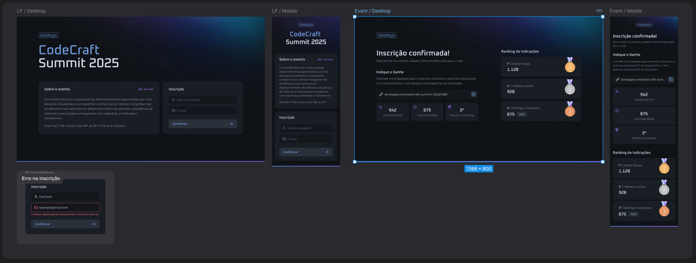

# Plataforma de Inscrição em Evento - React 19 & Next 15

Este projeto é uma plataforma moderna para inscrição em eventos e acompanhamento de ranking e estatísticas de indicações.
Desenvolvido com React 19, Next 15, Tailwind CSS e Zod, oferece uma experiência completa para desenvolvedores participarem
de eventos técnicos, convidarem amigos e monitorarem seu desempenho. Projeto baseado no evento NLW Connect da
[Rockeatseat](https://app.rocketseat.com.br)

## 📸 Capturas de Tela


## 🎯 Objetivo
Criar uma plataforma para eventos feitos por e para desenvolvedores, com foco em:
- Inscrição simplificada
- Sistema de indicação de amigos
- Ranking de participantes
- Estatísticas de engajamento
- Validação robusta de formulários
- Interface responsiva e acessível

## 🛠️ Tecnologias Utilizadas
- React 19
- Next.js 15
- TypeScript
- Tailwind CSS
- Zod (validação de formulários)
- HTML5 e CSS3

## ⚙️ Funcionalidades Principais
### Formulário de Inscrição
- Campos validados em tempo real com Zod
- Integração com API para registro seguro

### Sistema de Indicação
- Geração de links personalizados para convites
- Rastreamento de indicações em tempo real

### Ranking Competitivo
- Visualização de posição no ranking geral
- Medalhas por desempenho (Ouro, Prata, Bronze)

### Dashboard de Estatísticas
- Gráficos de crescimento de indicações
- Métricas de engajamento individual

### Design Responsivo
- Layout adaptável para todos os dispositivos
- Componentes reutilizáveis estilizados com Tailwind

## 🧰 Principais Componentes
- `SubscriptionForm`: Gerencia o formulário de inscrição com validação Zod
- `InviteLinkInput`: Gera e gerencia links de convite personalizados
- `Ranking`: Exibe o ranking de participantes com medalhas interativas
- `Stats`: Apresenta gráficos e métricas de desempenho
- `IconButton`: Botão com suporte a ícones personalizados
- `Input`: Componente de input estilizado e reutilizável

## 🚀 Como Executar o Projeto
### Pré-requisitos
- Node.js 18+
- npm 9+

### Clonar o repositório:
```bash
git clone https://github.com/josiassantos15/event-react-next.git
```

### Instalar dependências:
```bash
npm install
```
### Executar servidor de desenvolvimento:
```bash
npm run dev
```

### Acessar no navegador:
Abra http://localhost:3000 para visualizar a aplicação.

## 📂 Estrutura do Projeto
```plaintext
├── public/
│   ├── background.png
├── src/
│   ├── app/
│   │   ├── (home)/
│   │   │   └── page.tsx
│   │   │   └── subscription-form.tsx
│   │   ├── components/
│   │   │   ├── button.tsx
│   │   │   ├── icon-button.tsx
│   │   │   └── input.tsx
│   │   ├── invite/
│   │   │   ├── [subscriberid]/
│   │   │   │   └── page.tsx
│   │   │   │   └──invite-link-input.tsx
│   │   │   │   └── ranking.tsx
│   │   │   │   └── stats.tsx
│   │   ├── global.css
│   │   └── layout.tsx
│   ├── assets/
│   │   ├── logo.svg
│   │   ├── medal-gold.svg
│   │   ├── medal-silver.svg
│   │   └── medal-cooper.svg
│   ├── http/
│   │   └── api.ts
```

## 📌 Próximos Passos
- Implementação de autenticação JWT

- Integração com WebSocket para atualizações em tempo real

- Sistema de conquistas e badges

- Exportação de relatórios em PDF/CSV

## 🧑‍💻 Autor
- Desenvolvedor: Josias Santos
- [Email](josiassantos.contato@gmail.com)
- [GitHub](https://github.com/josiassantos15/)
